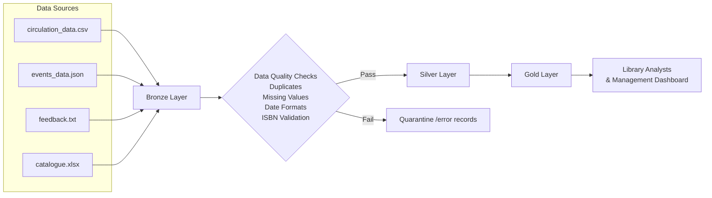

# Pipeline Architecture Diagram

---
title: Medallion Architecture ~ 4
tags: DE5M5

---
# Medallion Architecture - Group 4

## Task

Create a Mermaid diagram showing how this pipeline should be organised into Bronze, Silver and Gold layers.

Your diagram should show:

- source data
- Bronze layer
- Silver layer
- Gold layer
- at least one data quality or validation step
- at least one final output for a user or stakeholder

## Diagram

## Questions to answer:

### One design decision
- We decided to use a Medallion Architecture (Bronze, Silver, Gold) with a dedicated data quality validation step before data reaches the Silver layer. This ensures that only trusted, validated data is used for analysis while preserving the original raw data for auditing and reprocessing.

### One question or risk
- We are unsure about what to do with the records that are not passing the data quality checks and end up in the quarantine. Will someone review it ? Should they be ignored ?
